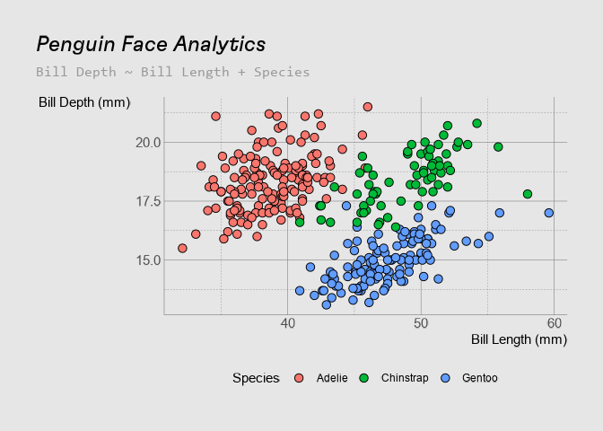

<!-- README.md is generated from README.Rmd. Please edit that file -->

# bptheme

<!-- badges: start -->

[](https://github.com/context-dependent/bptheme/actions/workflows/R-CMD-check.yaml)
<!-- badges: end -->

The goal of bptheme is to make effortless the application of Blueprint’s
current corporate graphic standards to your ggplots.

## Installation

You can install the development version of bptheme from
[GitHub](https://github.com/) with:

``` r
# install.packages("devtools")
devtools::install_github("context-dependent/bptheme")
```

## Example Usage

``` r
library(bptheme)
library(bpscales)
library(ggplot2)
library(palmerpenguins)
## basic example code

d <- penguins

showtext::showtext_begin()
d |>
  ggplot(aes(bill_length_mm, bill_depth_mm)) +
  geom_point(
    aes(fill = species),
    shape = 21,
    size = 3
  ) +
  theme_blueprint() +
  scale_fill_blueprint(discrete = TRUE)
#> Warning: Removed 2 rows containing missing values (`geom_point()`).
#> Warning in grid.Call(C_stringMetric, as.graphicsAnnot(x$label)): font family
#> 'Arial' not found, will use 'sans' instead

#> Warning in grid.Call(C_stringMetric, as.graphicsAnnot(x$label)): font family
#> 'Arial' not found, will use 'sans' instead

#> Warning in grid.Call(C_stringMetric, as.graphicsAnnot(x$label)): font family
#> 'Arial' not found, will use 'sans' instead

#> Warning in grid.Call(C_stringMetric, as.graphicsAnnot(x$label)): font family
#> 'Arial' not found, will use 'sans' instead

#> Warning in grid.Call(C_stringMetric, as.graphicsAnnot(x$label)): font family
#> 'Arial' not found, will use 'sans' instead

#> Warning in grid.Call(C_stringMetric, as.graphicsAnnot(x$label)): font family
#> 'Arial' not found, will use 'sans' instead

#> Warning in grid.Call(C_stringMetric, as.graphicsAnnot(x$label)): font family
#> 'Arial' not found, will use 'sans' instead

#> Warning in grid.Call(C_stringMetric, as.graphicsAnnot(x$label)): font family
#> 'Arial' not found, will use 'sans' instead

#> Warning in grid.Call(C_stringMetric, as.graphicsAnnot(x$label)): font family
#> 'Arial' not found, will use 'sans' instead

#> Warning in grid.Call(C_stringMetric, as.graphicsAnnot(x$label)): font family
#> 'Arial' not found, will use 'sans' instead

#> Warning in grid.Call(C_stringMetric, as.graphicsAnnot(x$label)): font family
#> 'Arial' not found, will use 'sans' instead

#> Warning in grid.Call(C_stringMetric, as.graphicsAnnot(x$label)): font family
#> 'Arial' not found, will use 'sans' instead

#> Warning in grid.Call(C_stringMetric, as.graphicsAnnot(x$label)): font family
#> 'Arial' not found, will use 'sans' instead

#> Warning in grid.Call(C_stringMetric, as.graphicsAnnot(x$label)): font family
#> 'Arial' not found, will use 'sans' instead
#> Warning in grid.Call(C_textBounds, as.graphicsAnnot(x$label), x$x, x$y, : font
#> family 'Arial' not found, will use 'sans' instead

#> Warning in grid.Call(C_textBounds, as.graphicsAnnot(x$label), x$x, x$y, : font
#> family 'Arial' not found, will use 'sans' instead

#> Warning in grid.Call(C_textBounds, as.graphicsAnnot(x$label), x$x, x$y, : font
#> family 'Arial' not found, will use 'sans' instead

#> Warning in grid.Call(C_textBounds, as.graphicsAnnot(x$label), x$x, x$y, : font
#> family 'Arial' not found, will use 'sans' instead

#> Warning in grid.Call(C_textBounds, as.graphicsAnnot(x$label), x$x, x$y, : font
#> family 'Arial' not found, will use 'sans' instead

#> Warning in grid.Call(C_textBounds, as.graphicsAnnot(x$label), x$x, x$y, : font
#> family 'Arial' not found, will use 'sans' instead

#> Warning in grid.Call(C_textBounds, as.graphicsAnnot(x$label), x$x, x$y, : font
#> family 'Arial' not found, will use 'sans' instead

#> Warning in grid.Call(C_textBounds, as.graphicsAnnot(x$label), x$x, x$y, : font
#> family 'Arial' not found, will use 'sans' instead

#> Warning in grid.Call(C_textBounds, as.graphicsAnnot(x$label), x$x, x$y, : font
#> family 'Arial' not found, will use 'sans' instead

#> Warning in grid.Call(C_textBounds, as.graphicsAnnot(x$label), x$x, x$y, : font
#> family 'Arial' not found, will use 'sans' instead
#> Warning in grid.Call(C_stringMetric, as.graphicsAnnot(x$label)): font family
#> 'Arial' not found, will use 'sans' instead

#> Warning in grid.Call(C_stringMetric, as.graphicsAnnot(x$label)): font family
#> 'Arial' not found, will use 'sans' instead

#> Warning in grid.Call(C_stringMetric, as.graphicsAnnot(x$label)): font family
#> 'Arial' not found, will use 'sans' instead

#> Warning in grid.Call(C_stringMetric, as.graphicsAnnot(x$label)): font family
#> 'Arial' not found, will use 'sans' instead

#> Warning in grid.Call(C_stringMetric, as.graphicsAnnot(x$label)): font family
#> 'Arial' not found, will use 'sans' instead

#> Warning in grid.Call(C_stringMetric, as.graphicsAnnot(x$label)): font family
#> 'Arial' not found, will use 'sans' instead

#> Warning in grid.Call(C_stringMetric, as.graphicsAnnot(x$label)): font family
#> 'Arial' not found, will use 'sans' instead

#> Warning in grid.Call(C_stringMetric, as.graphicsAnnot(x$label)): font family
#> 'Arial' not found, will use 'sans' instead

#> Warning in grid.Call(C_stringMetric, as.graphicsAnnot(x$label)): font family
#> 'Arial' not found, will use 'sans' instead

#> Warning in grid.Call(C_stringMetric, as.graphicsAnnot(x$label)): font family
#> 'Arial' not found, will use 'sans' instead

#> Warning in grid.Call(C_stringMetric, as.graphicsAnnot(x$label)): font family
#> 'Arial' not found, will use 'sans' instead

#> Warning in grid.Call(C_stringMetric, as.graphicsAnnot(x$label)): font family
#> 'Arial' not found, will use 'sans' instead

#> Warning in grid.Call(C_stringMetric, as.graphicsAnnot(x$label)): font family
#> 'Arial' not found, will use 'sans' instead

#> Warning in grid.Call(C_stringMetric, as.graphicsAnnot(x$label)): font family
#> 'Arial' not found, will use 'sans' instead
#> Warning in grid.Call(C_textBounds, as.graphicsAnnot(x$label), x$x, x$y, : font
#> family 'Arial' not found, will use 'sans' instead

#> Warning in grid.Call(C_textBounds, as.graphicsAnnot(x$label), x$x, x$y, : font
#> family 'Arial' not found, will use 'sans' instead

#> Warning in grid.Call(C_textBounds, as.graphicsAnnot(x$label), x$x, x$y, : font
#> family 'Arial' not found, will use 'sans' instead

#> Warning in grid.Call(C_textBounds, as.graphicsAnnot(x$label), x$x, x$y, : font
#> family 'Arial' not found, will use 'sans' instead

#> Warning in grid.Call(C_textBounds, as.graphicsAnnot(x$label), x$x, x$y, : font
#> family 'Arial' not found, will use 'sans' instead

#> Warning in grid.Call(C_textBounds, as.graphicsAnnot(x$label), x$x, x$y, : font
#> family 'Arial' not found, will use 'sans' instead

#> Warning in grid.Call(C_textBounds, as.graphicsAnnot(x$label), x$x, x$y, : font
#> family 'Arial' not found, will use 'sans' instead

#> Warning in grid.Call(C_textBounds, as.graphicsAnnot(x$label), x$x, x$y, : font
#> family 'Arial' not found, will use 'sans' instead

#> Warning in grid.Call(C_textBounds, as.graphicsAnnot(x$label), x$x, x$y, : font
#> family 'Arial' not found, will use 'sans' instead

#> Warning in grid.Call(C_textBounds, as.graphicsAnnot(x$label), x$x, x$y, : font
#> family 'Arial' not found, will use 'sans' instead

#> Warning in grid.Call(C_textBounds, as.graphicsAnnot(x$label), x$x, x$y, : font
#> family 'Arial' not found, will use 'sans' instead

#> Warning in grid.Call(C_textBounds, as.graphicsAnnot(x$label), x$x, x$y, : font
#> family 'Arial' not found, will use 'sans' instead

#> Warning in grid.Call(C_textBounds, as.graphicsAnnot(x$label), x$x, x$y, : font
#> family 'Arial' not found, will use 'sans' instead

#> Warning in grid.Call(C_textBounds, as.graphicsAnnot(x$label), x$x, x$y, : font
#> family 'Arial' not found, will use 'sans' instead

#> Warning in grid.Call(C_textBounds, as.graphicsAnnot(x$label), x$x, x$y, : font
#> family 'Arial' not found, will use 'sans' instead

#> Warning in grid.Call(C_textBounds, as.graphicsAnnot(x$label), x$x, x$y, : font
#> family 'Arial' not found, will use 'sans' instead

#> Warning in grid.Call(C_textBounds, as.graphicsAnnot(x$label), x$x, x$y, : font
#> family 'Arial' not found, will use 'sans' instead

#> Warning in grid.Call(C_textBounds, as.graphicsAnnot(x$label), x$x, x$y, : font
#> family 'Arial' not found, will use 'sans' instead

#> Warning in grid.Call(C_textBounds, as.graphicsAnnot(x$label), x$x, x$y, : font
#> family 'Arial' not found, will use 'sans' instead

#> Warning in grid.Call(C_textBounds, as.graphicsAnnot(x$label), x$x, x$y, : font
#> family 'Arial' not found, will use 'sans' instead

#> Warning in grid.Call(C_textBounds, as.graphicsAnnot(x$label), x$x, x$y, : font
#> family 'Arial' not found, will use 'sans' instead

#> Warning in grid.Call(C_textBounds, as.graphicsAnnot(x$label), x$x, x$y, : font
#> family 'Arial' not found, will use 'sans' instead

#> Warning in grid.Call(C_textBounds, as.graphicsAnnot(x$label), x$x, x$y, : font
#> family 'Arial' not found, will use 'sans' instead

#> Warning in grid.Call(C_textBounds, as.graphicsAnnot(x$label), x$x, x$y, : font
#> family 'Arial' not found, will use 'sans' instead

#> Warning in grid.Call(C_textBounds, as.graphicsAnnot(x$label), x$x, x$y, : font
#> family 'Arial' not found, will use 'sans' instead

#> Warning in grid.Call(C_textBounds, as.graphicsAnnot(x$label), x$x, x$y, : font
#> family 'Arial' not found, will use 'sans' instead

#> Warning in grid.Call(C_textBounds, as.graphicsAnnot(x$label), x$x, x$y, : font
#> family 'Arial' not found, will use 'sans' instead

#> Warning in grid.Call(C_textBounds, as.graphicsAnnot(x$label), x$x, x$y, : font
#> family 'Arial' not found, will use 'sans' instead

#> Warning in grid.Call(C_textBounds, as.graphicsAnnot(x$label), x$x, x$y, : font
#> family 'Arial' not found, will use 'sans' instead

#> Warning in grid.Call(C_textBounds, as.graphicsAnnot(x$label), x$x, x$y, : font
#> family 'Arial' not found, will use 'sans' instead

#> Warning in grid.Call(C_textBounds, as.graphicsAnnot(x$label), x$x, x$y, : font
#> family 'Arial' not found, will use 'sans' instead

#> Warning in grid.Call(C_textBounds, as.graphicsAnnot(x$label), x$x, x$y, : font
#> family 'Arial' not found, will use 'sans' instead

#> Warning in grid.Call(C_textBounds, as.graphicsAnnot(x$label), x$x, x$y, : font
#> family 'Arial' not found, will use 'sans' instead

#> Warning in grid.Call(C_textBounds, as.graphicsAnnot(x$label), x$x, x$y, : font
#> family 'Arial' not found, will use 'sans' instead

#> Warning in grid.Call(C_textBounds, as.graphicsAnnot(x$label), x$x, x$y, : font
#> family 'Arial' not found, will use 'sans' instead

#> Warning in grid.Call(C_textBounds, as.graphicsAnnot(x$label), x$x, x$y, : font
#> family 'Arial' not found, will use 'sans' instead

#> Warning in grid.Call(C_textBounds, as.graphicsAnnot(x$label), x$x, x$y, : font
#> family 'Arial' not found, will use 'sans' instead

#> Warning in grid.Call(C_textBounds, as.graphicsAnnot(x$label), x$x, x$y, : font
#> family 'Arial' not found, will use 'sans' instead

#> Warning in grid.Call(C_textBounds, as.graphicsAnnot(x$label), x$x, x$y, : font
#> family 'Arial' not found, will use 'sans' instead

#> Warning in grid.Call(C_textBounds, as.graphicsAnnot(x$label), x$x, x$y, : font
#> family 'Arial' not found, will use 'sans' instead

#> Warning in grid.Call(C_textBounds, as.graphicsAnnot(x$label), x$x, x$y, : font
#> family 'Arial' not found, will use 'sans' instead

#> Warning in grid.Call(C_textBounds, as.graphicsAnnot(x$label), x$x, x$y, : font
#> family 'Arial' not found, will use 'sans' instead

#> Warning in grid.Call(C_textBounds, as.graphicsAnnot(x$label), x$x, x$y, : font
#> family 'Arial' not found, will use 'sans' instead

#> Warning in grid.Call(C_textBounds, as.graphicsAnnot(x$label), x$x, x$y, : font
#> family 'Arial' not found, will use 'sans' instead

#> Warning in grid.Call(C_textBounds, as.graphicsAnnot(x$label), x$x, x$y, : font
#> family 'Arial' not found, will use 'sans' instead

#> Warning in grid.Call(C_textBounds, as.graphicsAnnot(x$label), x$x, x$y, : font
#> family 'Arial' not found, will use 'sans' instead

#> Warning in grid.Call(C_textBounds, as.graphicsAnnot(x$label), x$x, x$y, : font
#> family 'Arial' not found, will use 'sans' instead

#> Warning in grid.Call(C_textBounds, as.graphicsAnnot(x$label), x$x, x$y, : font
#> family 'Arial' not found, will use 'sans' instead

#> Warning in grid.Call(C_textBounds, as.graphicsAnnot(x$label), x$x, x$y, : font
#> family 'Arial' not found, will use 'sans' instead

#> Warning in grid.Call(C_textBounds, as.graphicsAnnot(x$label), x$x, x$y, : font
#> family 'Arial' not found, will use 'sans' instead

#> Warning in grid.Call(C_textBounds, as.graphicsAnnot(x$label), x$x, x$y, : font
#> family 'Arial' not found, will use 'sans' instead

#> Warning in grid.Call(C_textBounds, as.graphicsAnnot(x$label), x$x, x$y, : font
#> family 'Arial' not found, will use 'sans' instead

#> Warning in grid.Call(C_textBounds, as.graphicsAnnot(x$label), x$x, x$y, : font
#> family 'Arial' not found, will use 'sans' instead

#> Warning in grid.Call(C_textBounds, as.graphicsAnnot(x$label), x$x, x$y, : font
#> family 'Arial' not found, will use 'sans' instead

#> Warning in grid.Call(C_textBounds, as.graphicsAnnot(x$label), x$x, x$y, : font
#> family 'Arial' not found, will use 'sans' instead

#> Warning in grid.Call(C_textBounds, as.graphicsAnnot(x$label), x$x, x$y, : font
#> family 'Arial' not found, will use 'sans' instead

#> Warning in grid.Call(C_textBounds, as.graphicsAnnot(x$label), x$x, x$y, : font
#> family 'Arial' not found, will use 'sans' instead

#> Warning in grid.Call(C_textBounds, as.graphicsAnnot(x$label), x$x, x$y, : font
#> family 'Arial' not found, will use 'sans' instead

#> Warning in grid.Call(C_textBounds, as.graphicsAnnot(x$label), x$x, x$y, : font
#> family 'Arial' not found, will use 'sans' instead

#> Warning in grid.Call(C_textBounds, as.graphicsAnnot(x$label), x$x, x$y, : font
#> family 'Arial' not found, will use 'sans' instead

#> Warning in grid.Call(C_textBounds, as.graphicsAnnot(x$label), x$x, x$y, : font
#> family 'Arial' not found, will use 'sans' instead

#> Warning in grid.Call(C_textBounds, as.graphicsAnnot(x$label), x$x, x$y, : font
#> family 'Arial' not found, will use 'sans' instead

#> Warning in grid.Call(C_textBounds, as.graphicsAnnot(x$label), x$x, x$y, : font
#> family 'Arial' not found, will use 'sans' instead

#> Warning in grid.Call(C_textBounds, as.graphicsAnnot(x$label), x$x, x$y, : font
#> family 'Arial' not found, will use 'sans' instead

#> Warning in grid.Call(C_textBounds, as.graphicsAnnot(x$label), x$x, x$y, : font
#> family 'Arial' not found, will use 'sans' instead

#> Warning in grid.Call(C_textBounds, as.graphicsAnnot(x$label), x$x, x$y, : font
#> family 'Arial' not found, will use 'sans' instead

#> Warning in grid.Call(C_textBounds, as.graphicsAnnot(x$label), x$x, x$y, : font
#> family 'Arial' not found, will use 'sans' instead

#> Warning in grid.Call(C_textBounds, as.graphicsAnnot(x$label), x$x, x$y, : font
#> family 'Arial' not found, will use 'sans' instead

#> Warning in grid.Call(C_textBounds, as.graphicsAnnot(x$label), x$x, x$y, : font
#> family 'Arial' not found, will use 'sans' instead

#> Warning in grid.Call(C_textBounds, as.graphicsAnnot(x$label), x$x, x$y, : font
#> family 'Arial' not found, will use 'sans' instead

#> Warning in grid.Call(C_textBounds, as.graphicsAnnot(x$label), x$x, x$y, : font
#> family 'Arial' not found, will use 'sans' instead

#> Warning in grid.Call(C_textBounds, as.graphicsAnnot(x$label), x$x, x$y, : font
#> family 'Arial' not found, will use 'sans' instead

#> Warning in grid.Call(C_textBounds, as.graphicsAnnot(x$label), x$x, x$y, : font
#> family 'Arial' not found, will use 'sans' instead

#> Warning in grid.Call(C_textBounds, as.graphicsAnnot(x$label), x$x, x$y, : font
#> family 'Arial' not found, will use 'sans' instead

#> Warning in grid.Call(C_textBounds, as.graphicsAnnot(x$label), x$x, x$y, : font
#> family 'Arial' not found, will use 'sans' instead

#> Warning in grid.Call(C_textBounds, as.graphicsAnnot(x$label), x$x, x$y, : font
#> family 'Arial' not found, will use 'sans' instead

#> Warning in grid.Call(C_textBounds, as.graphicsAnnot(x$label), x$x, x$y, : font
#> family 'Arial' not found, will use 'sans' instead

#> Warning in grid.Call(C_textBounds, as.graphicsAnnot(x$label), x$x, x$y, : font
#> family 'Arial' not found, will use 'sans' instead

#> Warning in grid.Call(C_textBounds, as.graphicsAnnot(x$label), x$x, x$y, : font
#> family 'Arial' not found, will use 'sans' instead

#> Warning in grid.Call(C_textBounds, as.graphicsAnnot(x$label), x$x, x$y, : font
#> family 'Arial' not found, will use 'sans' instead

#> Warning in grid.Call(C_textBounds, as.graphicsAnnot(x$label), x$x, x$y, : font
#> family 'Arial' not found, will use 'sans' instead

#> Warning in grid.Call(C_textBounds, as.graphicsAnnot(x$label), x$x, x$y, : font
#> family 'Arial' not found, will use 'sans' instead

#> Warning in grid.Call(C_textBounds, as.graphicsAnnot(x$label), x$x, x$y, : font
#> family 'Arial' not found, will use 'sans' instead

#> Warning in grid.Call(C_textBounds, as.graphicsAnnot(x$label), x$x, x$y, : font
#> family 'Arial' not found, will use 'sans' instead

#> Warning in grid.Call(C_textBounds, as.graphicsAnnot(x$label), x$x, x$y, : font
#> family 'Arial' not found, will use 'sans' instead

#> Warning in grid.Call(C_textBounds, as.graphicsAnnot(x$label), x$x, x$y, : font
#> family 'Arial' not found, will use 'sans' instead

#> Warning in grid.Call(C_textBounds, as.graphicsAnnot(x$label), x$x, x$y, : font
#> family 'Arial' not found, will use 'sans' instead

#> Warning in grid.Call(C_textBounds, as.graphicsAnnot(x$label), x$x, x$y, : font
#> family 'Arial' not found, will use 'sans' instead

#> Warning in grid.Call(C_textBounds, as.graphicsAnnot(x$label), x$x, x$y, : font
#> family 'Arial' not found, will use 'sans' instead

#> Warning in grid.Call(C_textBounds, as.graphicsAnnot(x$label), x$x, x$y, : font
#> family 'Arial' not found, will use 'sans' instead

#> Warning in grid.Call(C_textBounds, as.graphicsAnnot(x$label), x$x, x$y, : font
#> family 'Arial' not found, will use 'sans' instead

#> Warning in grid.Call(C_textBounds, as.graphicsAnnot(x$label), x$x, x$y, : font
#> family 'Arial' not found, will use 'sans' instead

#> Warning in grid.Call(C_textBounds, as.graphicsAnnot(x$label), x$x, x$y, : font
#> family 'Arial' not found, will use 'sans' instead

#> Warning in grid.Call(C_textBounds, as.graphicsAnnot(x$label), x$x, x$y, : font
#> family 'Arial' not found, will use 'sans' instead

#> Warning in grid.Call(C_textBounds, as.graphicsAnnot(x$label), x$x, x$y, : font
#> family 'Arial' not found, will use 'sans' instead
#> Warning in grid.Call.graphics(C_text, as.graphicsAnnot(x$label), x$x, x$y, :
#> font family 'Arial' not found, will use 'sans' instead

#> Warning in grid.Call.graphics(C_text, as.graphicsAnnot(x$label), x$x, x$y, :
#> font family 'Arial' not found, will use 'sans' instead

#> Warning in grid.Call.graphics(C_text, as.graphicsAnnot(x$label), x$x, x$y, :
#> font family 'Arial' not found, will use 'sans' instead

#> Warning in grid.Call.graphics(C_text, as.graphicsAnnot(x$label), x$x, x$y, :
#> font family 'Arial' not found, will use 'sans' instead

#> Warning in grid.Call.graphics(C_text, as.graphicsAnnot(x$label), x$x, x$y, :
#> font family 'Arial' not found, will use 'sans' instead

#> Warning in grid.Call.graphics(C_text, as.graphicsAnnot(x$label), x$x, x$y, :
#> font family 'Arial' not found, will use 'sans' instead
#> Warning in grid.Call(C_textBounds, as.graphicsAnnot(x$label), x$x, x$y, : font
#> family 'Arial' not found, will use 'sans' instead

#> Warning in grid.Call(C_textBounds, as.graphicsAnnot(x$label), x$x, x$y, : font
#> family 'Arial' not found, will use 'sans' instead

#> Warning in grid.Call(C_textBounds, as.graphicsAnnot(x$label), x$x, x$y, : font
#> family 'Arial' not found, will use 'sans' instead

#> Warning in grid.Call(C_textBounds, as.graphicsAnnot(x$label), x$x, x$y, : font
#> family 'Arial' not found, will use 'sans' instead

#> Warning in grid.Call(C_textBounds, as.graphicsAnnot(x$label), x$x, x$y, : font
#> family 'Arial' not found, will use 'sans' instead

#> Warning in grid.Call(C_textBounds, as.graphicsAnnot(x$label), x$x, x$y, : font
#> family 'Arial' not found, will use 'sans' instead

#> Warning in grid.Call(C_textBounds, as.graphicsAnnot(x$label), x$x, x$y, : font
#> family 'Arial' not found, will use 'sans' instead

#> Warning in grid.Call(C_textBounds, as.graphicsAnnot(x$label), x$x, x$y, : font
#> family 'Arial' not found, will use 'sans' instead

#> Warning in grid.Call(C_textBounds, as.graphicsAnnot(x$label), x$x, x$y, : font
#> family 'Arial' not found, will use 'sans' instead

#> Warning in grid.Call(C_textBounds, as.graphicsAnnot(x$label), x$x, x$y, : font
#> family 'Arial' not found, will use 'sans' instead

#> Warning in grid.Call(C_textBounds, as.graphicsAnnot(x$label), x$x, x$y, : font
#> family 'Arial' not found, will use 'sans' instead

#> Warning in grid.Call(C_textBounds, as.graphicsAnnot(x$label), x$x, x$y, : font
#> family 'Arial' not found, will use 'sans' instead

#> Warning in grid.Call(C_textBounds, as.graphicsAnnot(x$label), x$x, x$y, : font
#> family 'Arial' not found, will use 'sans' instead

#> Warning in grid.Call(C_textBounds, as.graphicsAnnot(x$label), x$x, x$y, : font
#> family 'Arial' not found, will use 'sans' instead

#> Warning in grid.Call(C_textBounds, as.graphicsAnnot(x$label), x$x, x$y, : font
#> family 'Arial' not found, will use 'sans' instead

#> Warning in grid.Call(C_textBounds, as.graphicsAnnot(x$label), x$x, x$y, : font
#> family 'Arial' not found, will use 'sans' instead

#> Warning in grid.Call(C_textBounds, as.graphicsAnnot(x$label), x$x, x$y, : font
#> family 'Arial' not found, will use 'sans' instead

#> Warning in grid.Call(C_textBounds, as.graphicsAnnot(x$label), x$x, x$y, : font
#> family 'Arial' not found, will use 'sans' instead

#> Warning in grid.Call(C_textBounds, as.graphicsAnnot(x$label), x$x, x$y, : font
#> family 'Arial' not found, will use 'sans' instead

#> Warning in grid.Call(C_textBounds, as.graphicsAnnot(x$label), x$x, x$y, : font
#> family 'Arial' not found, will use 'sans' instead

#> Warning in grid.Call(C_textBounds, as.graphicsAnnot(x$label), x$x, x$y, : font
#> family 'Arial' not found, will use 'sans' instead

#> Warning in grid.Call(C_textBounds, as.graphicsAnnot(x$label), x$x, x$y, : font
#> family 'Arial' not found, will use 'sans' instead

#> Warning in grid.Call(C_textBounds, as.graphicsAnnot(x$label), x$x, x$y, : font
#> family 'Arial' not found, will use 'sans' instead

#> Warning in grid.Call(C_textBounds, as.graphicsAnnot(x$label), x$x, x$y, : font
#> family 'Arial' not found, will use 'sans' instead

#> Warning in grid.Call(C_textBounds, as.graphicsAnnot(x$label), x$x, x$y, : font
#> family 'Arial' not found, will use 'sans' instead

#> Warning in grid.Call(C_textBounds, as.graphicsAnnot(x$label), x$x, x$y, : font
#> family 'Arial' not found, will use 'sans' instead

#> Warning in grid.Call(C_textBounds, as.graphicsAnnot(x$label), x$x, x$y, : font
#> family 'Arial' not found, will use 'sans' instead

#> Warning in grid.Call(C_textBounds, as.graphicsAnnot(x$label), x$x, x$y, : font
#> family 'Arial' not found, will use 'sans' instead

#> Warning in grid.Call(C_textBounds, as.graphicsAnnot(x$label), x$x, x$y, : font
#> family 'Arial' not found, will use 'sans' instead

#> Warning in grid.Call(C_textBounds, as.graphicsAnnot(x$label), x$x, x$y, : font
#> family 'Arial' not found, will use 'sans' instead
#> Warning in grid.Call.graphics(C_text, as.graphicsAnnot(x$label), x$x, x$y, :
#> font family 'Arial' not found, will use 'sans' instead

#> Warning in grid.Call.graphics(C_text, as.graphicsAnnot(x$label), x$x, x$y, :
#> font family 'Arial' not found, will use 'sans' instead

#> Warning in grid.Call.graphics(C_text, as.graphicsAnnot(x$label), x$x, x$y, :
#> font family 'Arial' not found, will use 'sans' instead

#> Warning in grid.Call.graphics(C_text, as.graphicsAnnot(x$label), x$x, x$y, :
#> font family 'Arial' not found, will use 'sans' instead

#> Warning in grid.Call.graphics(C_text, as.graphicsAnnot(x$label), x$x, x$y, :
#> font family 'Arial' not found, will use 'sans' instead

#> Warning in grid.Call.graphics(C_text, as.graphicsAnnot(x$label), x$x, x$y, :
#> font family 'Arial' not found, will use 'sans' instead
#> Warning in grid.Call(C_textBounds, as.graphicsAnnot(x$label), x$x, x$y, : font
#> family 'Arial' not found, will use 'sans' instead

#> Warning in grid.Call(C_textBounds, as.graphicsAnnot(x$label), x$x, x$y, : font
#> family 'Arial' not found, will use 'sans' instead
#> Warning in grid.Call.graphics(C_text, as.graphicsAnnot(x$label), x$x, x$y, :
#> font family 'Arial' not found, will use 'sans' instead

#> Warning in grid.Call.graphics(C_text, as.graphicsAnnot(x$label), x$x, x$y, :
#> font family 'Arial' not found, will use 'sans' instead
#> Warning in grid.Call(C_textBounds, as.graphicsAnnot(x$label), x$x, x$y, : font
#> family 'Arial' not found, will use 'sans' instead

#> Warning in grid.Call(C_textBounds, as.graphicsAnnot(x$label), x$x, x$y, : font
#> family 'Arial' not found, will use 'sans' instead
#> Warning in grid.Call.graphics(C_text, as.graphicsAnnot(x$label), x$x, x$y, :
#> font family 'Arial' not found, will use 'sans' instead

#> Warning in grid.Call.graphics(C_text, as.graphicsAnnot(x$label), x$x, x$y, :
#> font family 'Arial' not found, will use 'sans' instead
#> Warning in grid.Call(C_textBounds, as.graphicsAnnot(x$label), x$x, x$y, : font
#> family 'Arial' not found, will use 'sans' instead

#> Warning in grid.Call(C_textBounds, as.graphicsAnnot(x$label), x$x, x$y, : font
#> family 'Arial' not found, will use 'sans' instead

#> Warning in grid.Call(C_textBounds, as.graphicsAnnot(x$label), x$x, x$y, : font
#> family 'Arial' not found, will use 'sans' instead

#> Warning in grid.Call(C_textBounds, as.graphicsAnnot(x$label), x$x, x$y, : font
#> family 'Arial' not found, will use 'sans' instead

#> Warning in grid.Call(C_textBounds, as.graphicsAnnot(x$label), x$x, x$y, : font
#> family 'Arial' not found, will use 'sans' instead

#> Warning in grid.Call(C_textBounds, as.graphicsAnnot(x$label), x$x, x$y, : font
#> family 'Arial' not found, will use 'sans' instead

#> Warning in grid.Call(C_textBounds, as.graphicsAnnot(x$label), x$x, x$y, : font
#> family 'Arial' not found, will use 'sans' instead

#> Warning in grid.Call(C_textBounds, as.graphicsAnnot(x$label), x$x, x$y, : font
#> family 'Arial' not found, will use 'sans' instead

#> Warning in grid.Call(C_textBounds, as.graphicsAnnot(x$label), x$x, x$y, : font
#> family 'Arial' not found, will use 'sans' instead

#> Warning in grid.Call(C_textBounds, as.graphicsAnnot(x$label), x$x, x$y, : font
#> family 'Arial' not found, will use 'sans' instead

#> Warning in grid.Call(C_textBounds, as.graphicsAnnot(x$label), x$x, x$y, : font
#> family 'Arial' not found, will use 'sans' instead

#> Warning in grid.Call(C_textBounds, as.graphicsAnnot(x$label), x$x, x$y, : font
#> family 'Arial' not found, will use 'sans' instead

#> Warning in grid.Call(C_textBounds, as.graphicsAnnot(x$label), x$x, x$y, : font
#> family 'Arial' not found, will use 'sans' instead

#> Warning in grid.Call(C_textBounds, as.graphicsAnnot(x$label), x$x, x$y, : font
#> family 'Arial' not found, will use 'sans' instead
#> Warning in grid.Call.graphics(C_text, as.graphicsAnnot(x$label), x$x, x$y, :
#> font family 'Arial' not found, will use 'sans' instead

#> Warning in grid.Call.graphics(C_text, as.graphicsAnnot(x$label), x$x, x$y, :
#> font family 'Arial' not found, will use 'sans' instead
#> Warning in grid.Call(C_textBounds, as.graphicsAnnot(x$label), x$x, x$y, : font
#> family 'Arial' not found, will use 'sans' instead

#> Warning in grid.Call(C_textBounds, as.graphicsAnnot(x$label), x$x, x$y, : font
#> family 'Arial' not found, will use 'sans' instead

#> Warning in grid.Call(C_textBounds, as.graphicsAnnot(x$label), x$x, x$y, : font
#> family 'Arial' not found, will use 'sans' instead

#> Warning in grid.Call(C_textBounds, as.graphicsAnnot(x$label), x$x, x$y, : font
#> family 'Arial' not found, will use 'sans' instead

#> Warning in grid.Call(C_textBounds, as.graphicsAnnot(x$label), x$x, x$y, : font
#> family 'Arial' not found, will use 'sans' instead

#> Warning in grid.Call(C_textBounds, as.graphicsAnnot(x$label), x$x, x$y, : font
#> family 'Arial' not found, will use 'sans' instead

#> Warning in grid.Call(C_textBounds, as.graphicsAnnot(x$label), x$x, x$y, : font
#> family 'Arial' not found, will use 'sans' instead

#> Warning in grid.Call(C_textBounds, as.graphicsAnnot(x$label), x$x, x$y, : font
#> family 'Arial' not found, will use 'sans' instead

#> Warning in grid.Call(C_textBounds, as.graphicsAnnot(x$label), x$x, x$y, : font
#> family 'Arial' not found, will use 'sans' instead

#> Warning in grid.Call(C_textBounds, as.graphicsAnnot(x$label), x$x, x$y, : font
#> family 'Arial' not found, will use 'sans' instead

#> Warning in grid.Call(C_textBounds, as.graphicsAnnot(x$label), x$x, x$y, : font
#> family 'Arial' not found, will use 'sans' instead

#> Warning in grid.Call(C_textBounds, as.graphicsAnnot(x$label), x$x, x$y, : font
#> family 'Arial' not found, will use 'sans' instead

#> Warning in grid.Call(C_textBounds, as.graphicsAnnot(x$label), x$x, x$y, : font
#> family 'Arial' not found, will use 'sans' instead

#> Warning in grid.Call(C_textBounds, as.graphicsAnnot(x$label), x$x, x$y, : font
#> family 'Arial' not found, will use 'sans' instead

#> Warning in grid.Call(C_textBounds, as.graphicsAnnot(x$label), x$x, x$y, : font
#> family 'Arial' not found, will use 'sans' instead
#> Warning in grid.Call.graphics(C_text, as.graphicsAnnot(x$label), x$x, x$y, :
#> font family 'Arial' not found, will use 'sans' instead

#> Warning in grid.Call.graphics(C_text, as.graphicsAnnot(x$label), x$x, x$y, :
#> font family 'Arial' not found, will use 'sans' instead
#> Warning in grid.Call(C_textBounds, as.graphicsAnnot(x$label), x$x, x$y, : font
#> family 'Arial' not found, will use 'sans' instead

#> Warning in grid.Call(C_textBounds, as.graphicsAnnot(x$label), x$x, x$y, : font
#> family 'Arial' not found, will use 'sans' instead

#> Warning in grid.Call(C_textBounds, as.graphicsAnnot(x$label), x$x, x$y, : font
#> family 'Arial' not found, will use 'sans' instead

#> Warning in grid.Call(C_textBounds, as.graphicsAnnot(x$label), x$x, x$y, : font
#> family 'Arial' not found, will use 'sans' instead

#> Warning in grid.Call(C_textBounds, as.graphicsAnnot(x$label), x$x, x$y, : font
#> family 'Arial' not found, will use 'sans' instead

#> Warning in grid.Call(C_textBounds, as.graphicsAnnot(x$label), x$x, x$y, : font
#> family 'Arial' not found, will use 'sans' instead

#> Warning in grid.Call(C_textBounds, as.graphicsAnnot(x$label), x$x, x$y, : font
#> family 'Arial' not found, will use 'sans' instead

#> Warning in grid.Call(C_textBounds, as.graphicsAnnot(x$label), x$x, x$y, : font
#> family 'Arial' not found, will use 'sans' instead

#> Warning in grid.Call(C_textBounds, as.graphicsAnnot(x$label), x$x, x$y, : font
#> family 'Arial' not found, will use 'sans' instead

#> Warning in grid.Call(C_textBounds, as.graphicsAnnot(x$label), x$x, x$y, : font
#> family 'Arial' not found, will use 'sans' instead

#> Warning in grid.Call(C_textBounds, as.graphicsAnnot(x$label), x$x, x$y, : font
#> family 'Arial' not found, will use 'sans' instead

#> Warning in grid.Call(C_textBounds, as.graphicsAnnot(x$label), x$x, x$y, : font
#> family 'Arial' not found, will use 'sans' instead

#> Warning in grid.Call(C_textBounds, as.graphicsAnnot(x$label), x$x, x$y, : font
#> family 'Arial' not found, will use 'sans' instead

#> Warning in grid.Call(C_textBounds, as.graphicsAnnot(x$label), x$x, x$y, : font
#> family 'Arial' not found, will use 'sans' instead
#> Warning in grid.Call.graphics(C_text, as.graphicsAnnot(x$label), x$x, x$y, :
#> font family 'Arial' not found, will use 'sans' instead

#> Warning in grid.Call.graphics(C_text, as.graphicsAnnot(x$label), x$x, x$y, :
#> font family 'Arial' not found, will use 'sans' instead
#> Warning in grid.Call(C_textBounds, as.graphicsAnnot(x$label), x$x, x$y, : font
#> family 'Arial' not found, will use 'sans' instead

#> Warning in grid.Call(C_textBounds, as.graphicsAnnot(x$label), x$x, x$y, : font
#> family 'Arial' not found, will use 'sans' instead

#> Warning in grid.Call(C_textBounds, as.graphicsAnnot(x$label), x$x, x$y, : font
#> family 'Arial' not found, will use 'sans' instead

#> Warning in grid.Call(C_textBounds, as.graphicsAnnot(x$label), x$x, x$y, : font
#> family 'Arial' not found, will use 'sans' instead

#> Warning in grid.Call(C_textBounds, as.graphicsAnnot(x$label), x$x, x$y, : font
#> family 'Arial' not found, will use 'sans' instead

#> Warning in grid.Call(C_textBounds, as.graphicsAnnot(x$label), x$x, x$y, : font
#> family 'Arial' not found, will use 'sans' instead

#> Warning in grid.Call(C_textBounds, as.graphicsAnnot(x$label), x$x, x$y, : font
#> family 'Arial' not found, will use 'sans' instead

#> Warning in grid.Call(C_textBounds, as.graphicsAnnot(x$label), x$x, x$y, : font
#> family 'Arial' not found, will use 'sans' instead

#> Warning in grid.Call(C_textBounds, as.graphicsAnnot(x$label), x$x, x$y, : font
#> family 'Arial' not found, will use 'sans' instead

#> Warning in grid.Call(C_textBounds, as.graphicsAnnot(x$label), x$x, x$y, : font
#> family 'Arial' not found, will use 'sans' instead

#> Warning in grid.Call(C_textBounds, as.graphicsAnnot(x$label), x$x, x$y, : font
#> family 'Arial' not found, will use 'sans' instead

#> Warning in grid.Call(C_textBounds, as.graphicsAnnot(x$label), x$x, x$y, : font
#> family 'Arial' not found, will use 'sans' instead

#> Warning in grid.Call(C_textBounds, as.graphicsAnnot(x$label), x$x, x$y, : font
#> family 'Arial' not found, will use 'sans' instead

#> Warning in grid.Call(C_textBounds, as.graphicsAnnot(x$label), x$x, x$y, : font
#> family 'Arial' not found, will use 'sans' instead
#> Warning in grid.Call.graphics(C_text, as.graphicsAnnot(x$label), x$x, x$y, :
#> font family 'Arial' not found, will use 'sans' instead

#> Warning in grid.Call.graphics(C_text, as.graphicsAnnot(x$label), x$x, x$y, :
#> font family 'Arial' not found, will use 'sans' instead
```



``` r
showtext::showtext_end()
```
