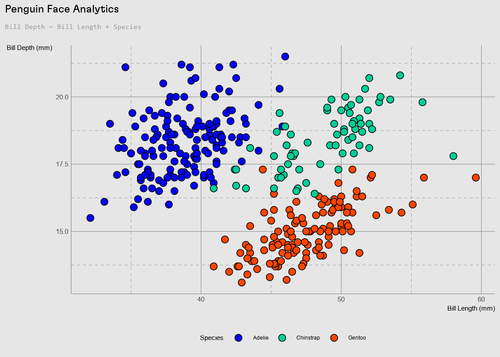

<!-- README.md is generated from README.Rmd. Please edit that file -->

# bptheme

<!-- badges: start -->

[](https://github.com/context-dependent/bptheme/actions/workflows/R-CMD-check.yaml)
<!-- badges: end -->

The goal of bptheme is to make effortless the application of Blueprint’s
current corporate graphic standards to your ggplots.

## Installation

You can install the development version of bptheme from
[GitHub](https://github.com/) with:

``` r
# install.packages("devtools")
devtools::install_github("context-dependent/bptheme")
```

## Example Usage

``` r
library(bptheme)
library(bpscales)
library(ggplot2)
library(showtext)
#> Loading required package: sysfonts
#> Loading required package: showtextdb
library(palmerpenguins)
## basic example code

d <- penguins

d |>
  ggplot(aes(bill_length_mm, bill_depth_mm)) +
  geom_point(aes(fill = species), shape = 21, size = 3) +
  labs(
    title = "Penguin Face Analytics",
    subtitle = "Bill Depth ~ Bill Length + Species",
    x = "Bill Length (mm)",
    y = "Bill Depth (mm)",
    fill = "Species"
  ) +
  theme_blueprint() +
  scale_fill_blueprint(
    discrete = TRUE,
    type = "multi", option = "spectrum",
    begin = .25, end = .75
  )
#> Warning: Removed 2 rows containing missing values (`geom_point()`).
```


